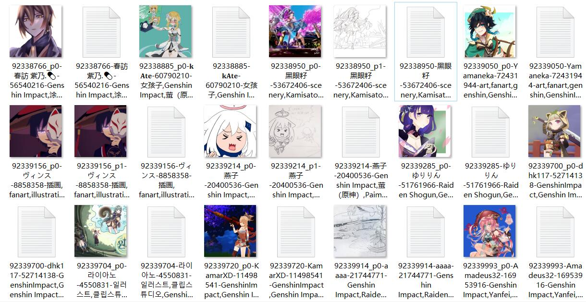
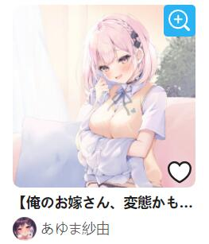
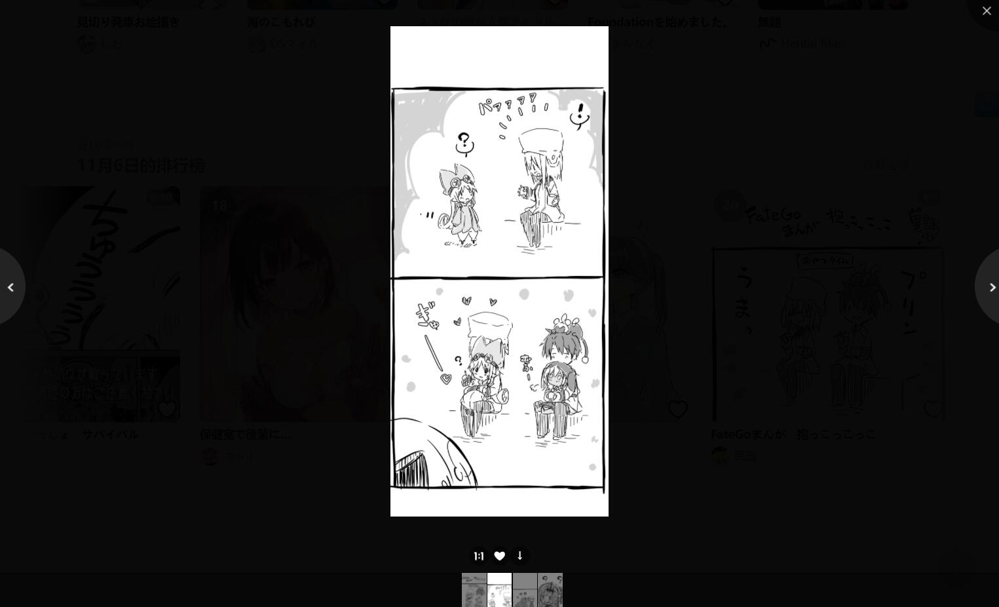
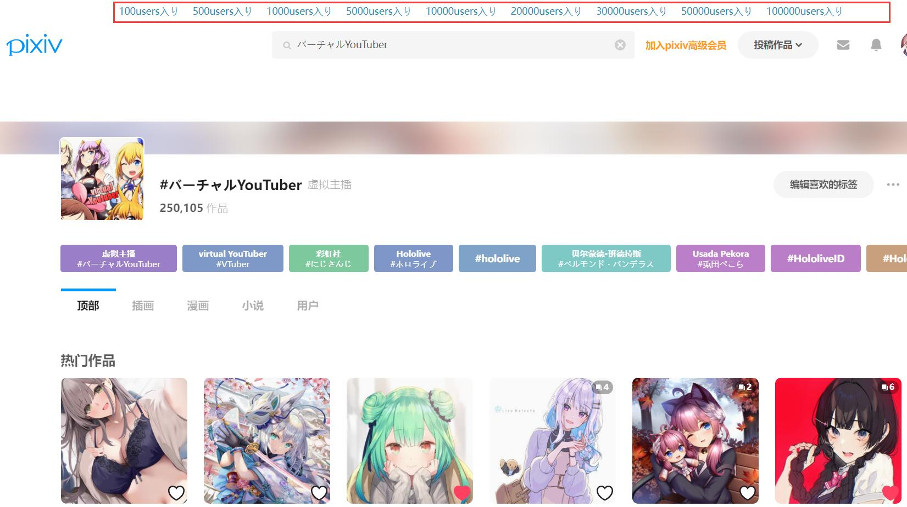
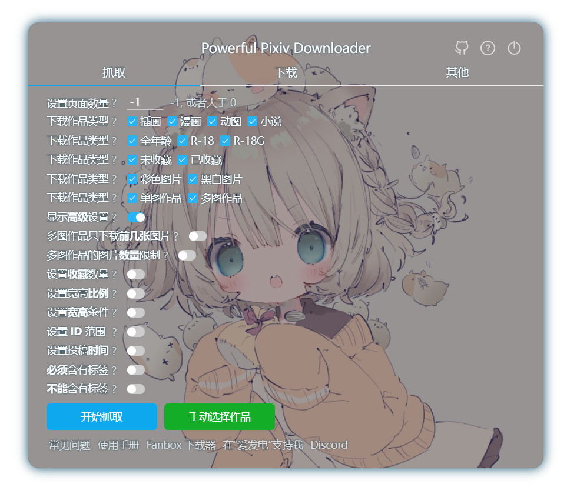

# 设置-其他

“其他”选项卡保存着许多设置，有一些设置是用于抓取和下载的。为了节约“抓取”和“下载”选项卡的空间，我把它们放到了“其他”选项卡里。

## 添加命名标记前缀


默认未启用。

当用户在命名规则里使用了多个标记时，文件名里储存了多种信息，它们之间可能难以区分开来。

如果启用了这个设置，本程序会在一些标记前面添加一些前缀。详细情况如下：

- `{title}` 生成结果时，前面加上了 `titl`e_ 字符。
- `{tags}` 和 `{tags_translate}` 生成结果时，前面加上了 `tags`_ 字符。
- `{user}` 生成结果时，前面加上了 `user`_ 字符。
- `{userid}` 生成结果时，前面加上了 `uid_` 字符。
- `{bmk}` 生成结果时，前面加上了 `bmk_` 字符。

其他标记没有添加说明文字。

如果你有需要，你可以在命名规则里手动输入你要使用的字符。

## 第一张图不带序号


```
第一张图不带序号 ?  ✓ 单图作品  ✓ 多图作品
```

默认未启用。

什么是序号？如果你使用 `{id}` 命名，每个作品的 id 后面都会带序号，如：

```
80447108_p0
80447108_p1
80447108_p2
```

如果你使用了 `{p_num}`，也会显示序号。`{p_num}` 不带 `_p` 字符，是单纯的数字序号。

如果你开启了这个选项，下载器会去掉**每个作品的第一张图片**的序号，变成这样：

```
// 第一张图片去掉了序号 0
80447108
80447108_p1
80447108_p2
```

在子选项中，你可以设置此功能的作用范围。例如你希望单图不带序号，多图保留序号，就可以只选中单图作品。

## 在序号前面填充 0


默认未启用。

插画和漫画作品因为可能有多张图片，所以是有序号的。

下载器默认不会在序号前添加 0，但是一些软件对于文件名排序不正确，在这种情况下需要添加 0。

开启这个设置后，序号的形式可能如下：

```
001
002
003
...
010
011
012
...
```

你可以在子选项里设置填充后的长度，默认为 3。（因为插画和漫画最多可以有 200 p，所以长度应该设置为 3）。

### 文件名长度限制


设置文件名的长度上限。这个长度不包括文件夹路径的长度，只包括文件名 + 后缀名。

默认未启用。

**一般不需要开启。**除非当你确定是因为文件名太长导致了问题，才需要启用这个设置。

一般来说，如果文件名太长的话，Chrome 会自动截断超出的部分，不会导致保存失败。

但是在一些特殊情况下，Chrome 可能不会自动截断文件名，这有可能导致保存失败。例如：你把下载位置设置到 NAS 或云端硬盘时。

## 动图保存格式


下载器在下载动图作品时，可以将其保存为 WebM 视频，或者 GIF 图片，或者 APNG 图片，或者 Zip 压缩包。

**各种格式的特点：**

-  WebM 视频画质高，体积小。是默认选项。但是在手机上使用可能不太方便。
-  GIF 格式是常用的动态图片格式。但是画质差，体积大。
-  APNG 格式是**无损**画质的动图格式。画质最佳，但是体积最大。
-  Zip 格式，不需要转换，但是没有动画效果。

**提醒：**

- 把动图转换为视频需要一些时间，如果下载动图时，进度条不动了，这是正常的，此时本程序在把动图转换为视频。
- 动图的源文件的体积越大，转换时的内存占用也越大。

### 转换动图时保持页面不被完全遮挡

下载器在转换动图时，如果当前页面被隐藏了，转换速度就会变得很慢。这是 Chrome 为了节省电量做出的限制。

转换动图时，如果你切换到了其他程序，请确保这个程序是窗口化的（不是最大化），让你**能够看到转换动图的页面的一部分**，这样就不会受到限制。

如果你要在转换期间切换到其他网页，可以先把转换动图的页面拖出来成为一个独立的窗口，然后把之前的浏览器窗口取消最大化，不要把转换的那个页面完全挡住。

---------

“隐藏”指这个页面被完全遮挡住，对用户来说是完全看不见的。例如：

- 用户切换到了另一个页面，导致页面看不到了
- 浏览器被最小化了，导致页面看不到了
- 浏览器被一个最大化的窗口遮挡了，导致页面看不到了

如果这个页面至少有一部分可以被用户看到，那么就不是隐藏状态。

## 同时转换多少个动图


默认值是 1，这是因为同时转换多个动图会增加资源占用。

**提醒：**

1. 如果资源占用太多，可能会导致页面崩溃。所以这个值不应该设置的太大。
2. 动图的同时转换数量不会超过下载线程数。也就是说同时下载几个，最多也就只能同时转换几个。

## 小说保存格式


你可以选择把小说保存为 txt 格式或者 epub 格式。

txt 格式通用性好，但是内容是纯文本，不能保存封面图片、超链接等数据。

epub 可以保存封面图片，保留文字的颜色，使用超链接。（前提是这个小说有这些数据）

epub 的阅读体验比较好，但是需要安装专门的软件才能打开查看。

## 在小说里保存元数据


如果你启用了这个选项，本程序会在小说内容的开头保存以下信息：

- 小说标题
- 作者
- 网址
- 简介
- 标签

如果你关闭了这个选项，那么小说内容里只有小说主体文本。

不管小说是保存成 txt 格式还是 epub ，都会应用这个设置。

## 保存作品的元数据


```
保存作品的元数据 ?   插画   漫画   动图   小说 
```

如果用户勾选了对应的作品类型，下载器在下载这类作品时会为每一个作品建立一个 txt 文件，保存它的一些元数据，例如标题、简介、标签等。

效果图示例：



**提示：**

这个功能是会单独建立一个 txt 文件的，所以它适合保存图片作品的元数据，不太适合保存小说的元数据。

因为小说本来就是文本文件，如果再单独建立一个 txt 文件保存元数据，可能会导致混乱。小说的元数据还是建议使用“在小说里保存元数据”的设置。

## 图片尺寸


你可以选择下载的图片尺寸。

- 原图：原图尺寸
- 普通：最大尺寸为 1200*1200 px。如果原图比这个尺寸大，会按比例缩放到这个尺寸。
- 小图：最大尺寸为 540*540 px。如果原图比这个尺寸大，会按比例缩放到这个尺寸。
- 方形缩略图：尺寸为 250*250 px。总是正方形的。

?>这些尺寸的图片都是 Pixiv 自动生成的，不是下载器自己进行裁剪的结果。

注意：

方形缩略图总是正方形的，它不会保持图片原图的比例。

方形缩略图适合用作预览图、封面图，或者用来制作图标。

## 文件体积限制


当一个文件开始下载时，如果它的体积不在指定的范围内，下载器就会跳过下载这个文件。

默认未启用。

## 不下载重复文件


如果启用了“不下载重复文件”选项，那么下载器会跳过下载重复的文件。

### 原理

当成功下载了一个文件之后，下载器会在 IndexedDB 数据库里保存一条记录，包含作品的 id 、作品的修改日期、下载时的文件名。例如：

```
{
  "id": "85290993_p0",
  "d": "2021/05/22/13/07/51",
  "n": "85290993_p0-小日向ほしみ-原创,女孩子,原创,waitress,过膝袜.jpg"
}
```

在下载一个文件之前，下载器会查询记录，判断这个文件是不是重复文件。

!>下载器只会查询自己的下载记录，不会检查硬盘上的文件（因为没有这个权限）。所以这个方法并不完美。

例如你要下载的某个文件在硬盘上已存在，但是下载器没有记录，就仍然会下载它。

相反的，如果你之前下载过某个文件，之后在硬盘上把它删除了，但是在下载器里有记录，那么下载器就不会再次下载它（如果你没有开启此选项，则可以再次下载）。

### 严格策略

检查全部 3 个条件：

作品的 id 、作品的修改日期、下载时的文件名。

如果当前下载的这个文件存在下载记录，并且三个条件都完全一致（没有变化），则认为这个文件是重复文件。

### 宽松策略

检查 2 个条件：

作品的 id 、作品的修改日期。

不会比较文件名。

### 导出

点击导出按钮，可以导出所有下载记录，格式为 json 文件。

?>如果你清除了浏览器数据中的“Cookie 及其他网站数据”，那么下载器的数据也被清空。你可以先导出下载记录，以便之后进行恢复。

### 导入

点击导入按钮，你可以选择导出的下载记录文件，导入到下载器的下载记录里。

使用导入按钮，你只能导入 JSON 文件（下载器导出的记录文件）。

### 导入 id 列表

这是个隐藏功能，可以在页面上输入口令 `recordtxt` 使用。

本来，下载器只能导入自己导出的下载记录（JSON 文件），不支持导入其他格式的文件。

但是有用户想导入 txt 格式的 id 列表，如：

```
84334853_p0
84334853_p1
84334853_p2
```

所以我添加了这个隐藏功能。

txt 文件的内容必须是文件 ID（并且一定要带序号），否则即使导入了，和下载器内部的格式不一致，也是无法生效的。

**注意：** 导入 id 列表之后，只适合使用“宽松”策略。（因为这样只导入了 id，没有其他数据）

### 清除下载记录

清空下载器的所有下载记录。

即使你把下载到硬盘上的文件删除掉，但是下载器里依然会存在着它的下载记录。当你再次下载时，下载器会认为这个文件已经下载过了，导致下载器不会再下载它。

如果你遇到了这种情况，可以清除下载记录，或者关闭“不下载重复文件”的选项。

## 自动导出抓取结果


默认未开启。

启用此设置后，下载器在抓取完成之后会自动导出抓取结果。

你可以选择导出为 CSV 文件或（和）JSON 文件。

## 用户阻止名单


启用这个选项之后，你可以输入想要屏蔽的用户的 id，这样下载器就不会下载这些用户的作品。

默认未启用。

**注意：**

1. 需要输入**用户 ID**，而不是输入用户名。因为用户名不唯一。
2. 如果要屏蔽多个用户，可以输入多个用户 id，中间使用英文逗号 `,` 分割。

## 针对特定用户屏蔽标签


如果你不喜欢某个用户的某些分类作品，你可以使用此功能。

开启此设置后，输入用户 ID 和不想下载的标签，这样当下载器下载这个用户的作品时，会自动过滤屏蔽的标签。

默认未启用。

## 预览作品


默认启用。

当鼠标停留在作品的缩略图上时，下载器会显示更大尺寸的预览图。

效果如下图：


等待时间：设置鼠标在作品缩略图上停留指定时间后，才会显示预览图。

提示：
- 预览区域会自适应可用区域，不会超出屏幕外。
- 如果一个作品有多张图片，在它的缩略图上滚动鼠标滚轮可以切换显示所有图片。
- 预览区域的顶部会显示作品的尺寸、标题、简介。
- 预览图默认加载“普通”（1200px）尺寸的图片。这对于大多数用户来说已经够用，而且加载速度快。
- 如果你的屏幕非常大，预览图显示完之后四周还有多余的空间，那么你可以选择“原图”。但是这会导致预览图的加载速度变慢。
- 当鼠标移出作品缩略图时，预览区域会自动隐藏。如果它没有自动隐藏，你可以用鼠标左键点击它，使它隐藏。
- 你可以使用快捷键 Alt+P 来切换开启/关闭此功能。

## 替换方形缩略图以显示图片比例


pixiv 新版页面的缩略图都是正方形，不像旧版那样可以看到图片的全貌，也看不出来图片的比例（横图还是竖图）。

启用这个设置之后，可以把方形缩略图替换为 540px 尺寸的缩略图，可以看到图片的全貌和原始比例。

## 在缩略图上长按鼠标右键时查看大图


默认启用。

当用户在作品的缩略图上长按鼠标右键时，下载器会显示大图。

默认显示原图。默认以原始尺寸（1:1）显示图片。

你可以使用鼠标滚轮放大或者缩小图片，也可以移动鼠标查看图片被隐藏的区域。

## 在作品缩略图上显示放大图标


当你的鼠标经过 Pixiv 页面上的作品缩略图时，缩略图上面会显示一个放大镜图标。



点击放大镜图标可以打开图片查看器，查看这个作品里的每一张图片。

默认开启。图片查看器的效果如下：



在查看图片时，你可以点击图片查看器下方的按钮，收藏或者下载这个作品。

### 位置

- 左：放大镜图标显示在缩略图的左上角。
- 右：放大镜图标显示在缩略图的右上角。

### 图片尺寸

- 原图：点击放大镜图标后，在图片查看器里加载原始尺寸的图片。
- 普通：点击放大镜图标后，在图片查看器里加载普通尺寸的图片（最大 1200px * 1200px）。

默认值是“原图”。

这个设置只影响在图片查看器里显示的图片的尺寸，不会影响下载按钮所下载的图片的尺寸。

## 在图片作品的缩略图上显示下载按钮


默认开启。

启用此设置后，当用户把鼠标放在图片缩略图上的时候，下载器会在缩略图上显示一个下载按钮。


点击下载按钮就可以直接下载这个作品。这样可以提高下载效率。

## 在搜索页面添加快捷搜索区域


下载器会在搜索页的顶部添加一些快捷搜索的按钮，例如：

```
100users入り 500users入り 1000users入り 5000users入り 10000users入り 20000users入り 30000users入り 50000users入り  100000users入り
```
这个设置项控制是否显示这些按钮。默认开启。

启用之后的效果：



点击这些按钮，下载器就会在当前标签后面附加收藏数量的标签，一起搜索。

例如在搜索“バーチャルYouTuber”的页面点击 “10000users入り” 就会自动搜索“バーチャルYouTuber 10000users入り”。

?>此功能对于非 Pixiv 高级会员（premium）用户比较有用。如果你是 Pixiv 高级会员，可以考虑关闭这个功能。

## 预览搜索页面的筛选结果


默认启用。

当用户在图片搜索页面进行抓取时，下载器会把抓取到的作品显示在当前页面里。

这是为了方便用户预览结果，并且便于进行多次筛选，提供所见即所得的下载体验。

此外，当抓取完毕时，下载器还会根据作品的收藏数量，自动从高到低排序。

**提醒：**

1. 此设置只在图片搜索页面生效。
2. 当此设置启用时，“自动开始下载”设置不会生效。也就是不会自动开始下载。这是为了让用户在下载前有机会多次筛选结果，然后再下载。如果你不想筛选，而是想直接自动下载，可以考虑关闭这个设置。

### 上限

有时候下载器抓取到的作品的数量可能有很多（例如有数万个作品），如果把作品全部显示到页面上，那么页面占用的资源会比较多，可能会导致浏览器崩溃。

所以你可以设置“上限”来限制最多显示多少个作品。

默认最多显示 3000 个作品，你可以加大显示的数量，但是如果设置的过大，可能导致页面崩溃。

## 收藏设置


当下载器把作品添加到收藏时，你可以设置：

1. 是否附带标签
2. 是否为公开收藏

这会影响很多通过下载器添加收藏的操作。

**注意：** Pixiv 本身的收藏按钮（心形）不受此设置影响。

**受此设置影响的地方：**

- 作品页面里的快速收藏（☆）按钮
- 搜索页面的快速收藏（☆）按钮
- 收藏本页面所有作品的功能
- 下载后收藏作品的功能

**不受此设置影响的地方：**

在收藏页面里的“给未分类作品添加标签”按钮不受影响。因为这个功能必定会附带标签。并且会根据这个作品之前的收藏状态，自动设置公开或者不公开。


## 日期和时间格式


你可以使用以下标记来设置日期和时间格式，**区分大小写**。

这会影响命名规则里的 `{date}` 和 `{task_date}`。

对于时间如 `2021-04-30T06:40:08`，各个标记的结果如下:

```
YYYY 2021
YY 21
MM 04
MMM Apr
MMMM April
DD 30
hh 06
mm 40
ss 08
```

## 颜色主题


设置下载器的颜色主题，默认为自动检测。此时下载器会自动判断 pixiv 的主题，然后使用与之相同的主题。

你可以通过这个选项单独设置下载器的主题，使其可以不同于 pixiv 的主题。 

下载器的主题目前只有白色和黑色。

## 背景图片

你可以选择自己喜欢的图片作为下载器的背景图片，并且可以调节透明度、对齐方式。

效果如下：



**提示：**

建议使用颜色较暗的图片作为背景图片。

## 选项卡切换方式


```
○ 鼠标经过   ○ 鼠标点击
```

用户可以选择使用哪种方式切换下载器的选项卡。

默认方式是鼠标经过，这样更快捷。

一些用户担心鼠标经过的方式会误操作，此时可以选择鼠标点击的方式。

## Language


```
Language  自动检测    简体中文    繁體中文    日本語    English  
```

你可以设置下载器使用的语言。这不会影响 Pixiv 的语言。

一般无需设置，保持默认的“自动检测”即可。这样下载器会使用和 Pixiv 页面一致的语言。

如果你想让两者不同，比如 Pixiv 使用日语，下载器使用中文，就可以修改此设置。

!>下载器目前没有韩语文本。

## 用粗体显示关键字


默认开启。

开启之后，下载器的设置项的一些文字会以粗体显示，并且颜色变成蓝色。

这是因为下载器的设置项太多了，用户想要找到一个特定设置项时可能会花费比较长的时间。加粗显示关键字可以提高查找设置的效率。

## 管理设置


你可以点击对应的文字进行操作：

1. 导出设置（导出一个 json 文件）
2. 导入设置（选择你之前导出的 json 文件，进行恢复）
3. 重置设置（将所有设置恢复为默认值）

?>使用此功能，你可以保存多套设置，并根据需要加载设置。

## 根据 sl 创建文件夹

根据作品的 sl 数据创建文件夹。这个选项默认是关闭的，而且这是一个隐藏设置。

开关这个设置的方法：在页面上用键盘键入口令：（任选其一）

- `switchsl`
- `kaiguansl`


sl 是作品数据里的一个字段，可能和“色情指数”有关。

sl 的值及其作用：（推测）

- sl 0 的是新发布的普通作品，可能是未进行测定。在发布后经过一段时间后，会变成其他数值。
- sl 2 的基本都没什么色情元素；
- sl 4 的大部分都有一定的色情元素，比如巨乳、大白腿、衣服裸露程度较高，但一般达不到 R-18 的级别。
- sl 6 的大部分都有强烈的色情元素，有很多是 R-18 作品。即使不是 R-18 作品，也会有很多擦边球。

根据作品的 sl 数据创建文件夹，可能会产生以下几种名称的文件夹：

- sl0
- sl2
- sl4
- sl8

>小说作品没有 sl 数据，所以不会用 sl 建立文件夹；只有插画、漫画、动图可以用 sl 建立文件夹。

## 优先下载动图

这个选项默认是关闭的，而且这是一个隐藏设置。

开关这个设置的方法：在页面上用键盘键入口令：（任选其一）

- `dlugoirafirst`
- `qw111`

启用此设置之后，当下载器抓取完成时，会把结果中的动图排列到最前面，这样就可以优先下载动图。
