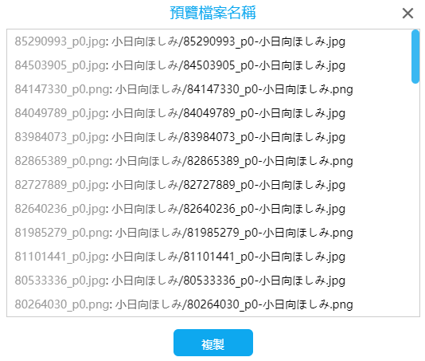
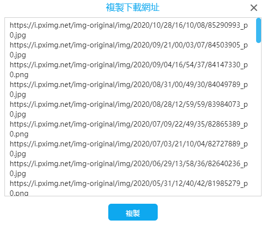

# 下載相關按鈕

## 預覽檔案名稱


這個按鈕可以預覽生成的檔名。



對於要下載的每一個檔案，都會以以下格式輸出一條結果：

`（預設的檔名 ｛id｝的生成結果）+（: ）+（命名規則生成的檔名）`

你可以點選複製按鈕，複製輸出的內容。

這個功能對於預覽檔名、編寫重新命名指令碼都很有用。

------

舉個例子，在 windows 上，你可以這樣編寫重新命名的命令。首先複製預覽的一條結果，如下：

```
79992391_p0.jpg: #VOCALOID 392020 - ginklaga的插畫 - pixiv/79992391_p0-user_ginklaga.jpg
```

把格式修改為 `ren` + 空格 + 原檔名 + 空格 + 新的檔名（去掉資料夾的路徑，檔名可以加上雙引號）：

```
ren 79992391_p0.jpg "79992391_p0-user_ginklaga.jpg"
```

把 CMD 定位到要重新命名的檔案的目錄，執行這個重新命名命令。

你可以使用一些程式碼編輯器，批次編輯多行文字。

------

假如你第一次下載檔案時，使用了命名規則 A，下載完了之後發現不對，想要改成命名規則 B。你可以使用命名規則 A 和 B 預覽生成的結果，並且分別複製結果，儲存起來。之後參考上面編寫重新命名規則的例子，把命名規則 A 的檔名（不含路徑）作為原檔名，把命名規則 B 的檔名（不含路徑）作為新檔名，編寫重新命名指令碼。

如果你覺得不容易操作，可以使用命名規則 B 重新下載一次。

## 匯出 CSV 文檔


當你抓取了作品之後，可以將作品的一些資料匯出到 csv 檔案裡。

效果如圖：


這個 csv 檔案儲存了每個作品的一些資訊。

一個多圖作品在下載時可能產生多個檔案，但是 csv 檔案裡只會儲存一份資訊。（第一張圖的資訊）

這個檔案不能用於恢復下載。但是你可以複製 `id` 列的資料，然後到首頁使用“輸入 id 進行抓取”，這樣可以再次下載這些檔案。

## 匯出抓取結果


這個按鈕可以匯出下載器內部儲存的抓取結果，儲存為 json 檔案。

匯出抓取結果可以用於除錯，或者提取裡面儲存的資料。

理論上，可以把匯出的抓取結果進行匯入，直接開始下載（小說除外）。但是這種需要並不常見，所以沒有做匯入功能。

!>小說的一項資料 `novelBlob` 無法匯出，因為它是 Blob 類型，無法儲存到 json 檔案裡。匯出抓取結果時會丟失這項資料。

## 開始下載

當抓取完作品時，你可以點選“開始下載”按鈕，進行下載。

?>如果“自動開始下載”已啟用，那麼使用者不需要手動點選此按鈕。下載會自動開始。

## 暫停下載

暫停下載任務，下載進度不會清空。

之後點選“開始下載”按鈕可以**繼續下載**。

## 停止下載

停止下載任務，這會清空下載進度。

之後點選“開始下載”按鈕將會**重新開始下載**。

?>停止下載也會清除儲存這次任務的斷點續傳資料。

## 複製下載網址

這個按鈕可以輸出要下載的圖片的 url。



每行顯示一個圖片的 url。你可以點選複製按鈕，複製輸出的內容。

?>有時候，你可能想用其他軟體下載，如迅雷、IDM 之類。這時這個功能就很有用。
