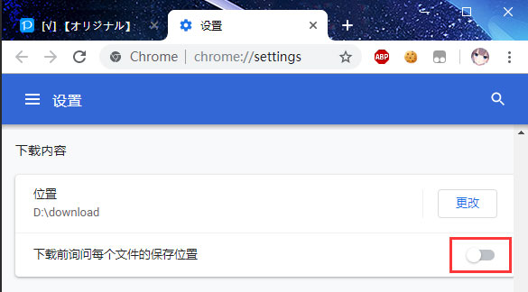
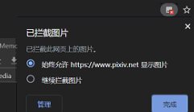

# 安裝之後

## 檢查瀏覽器的下載設定

在瀏覽器的下載設定裡，你可以確認：

1. 檔案儲存位置。下載器下載的檔案會儲存在這個目錄裡。

2. **關閉**“下載前詢問每個檔案的儲存位置”。否則每下一個檔案就會彈出“另存為”對話方塊。

!>如果你沒有開啟第二項，但下載時還是出現了“另存為”對話方塊，可能是因為下載的檔案有重名。請參考“常見問題”頁面的“下載時彈出另存為對話方塊”條目。

## 留意有衝突的擴充套件程式

本程式下載檔案時，可以自由設定檔名。但是這個功能和其他能夠**管理下載任務**的擴充套件不相容。例如：

- 迅雷下載支援（最近也可能不衝突了）

- Chrono 下載管理器

- 用於隱藏 Chrome 底部下載專案的擴充套件

諸如此類的下載管理擴充套件，會接管本程式的下載任務，那麼檔名就會是一長串無意義的字元。如果你遇到了這種情況，就需要**在使用本程式時禁用有衝突的擴充套件程式**。

## 不要在隱身模式中使用

在隱身模式中使用本程式時，可能會出現下載錯誤。所以請不要在隱身模式中使用本程式。

## 不要攔截 Pixiv 的圖片

在 Chrome 中，使用者可以設定攔截網頁上的圖片，這樣 Chrome 不會下載和顯示該網頁上的圖片。

當 Chrome 攔截了 Pixiv 的圖片時，會在位址列右側顯示一個攔截圖示。

如果你攔截了 Pixiv 上的圖片，會導致本程式無法下載圖片。請不要攔截 Pixiv 的圖片。
